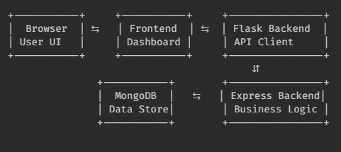

# Transport Management System (v2.0.1)

## Inhaltsverzeichnis

1. [Projektbeschreibung](#1-projektbeschreibung)
2. [Ziel des Projekts](#2-ziel-des-projekts)
3. [Projektabgrenzung](#3-projektabgrenzung)
4. [Technische Grundlagen](#4-technische-grundlagen)
5. [Systemarchitektur](#5-systemarchitektur)
6. [Installation und Inbetriebnahme](#6-installation-und-inbetriebnahme)
7. [Verwendung der Anwendung](#7-verwendung-der-anwendung)
8. [Projektstruktur](#8-projektstruktur)
9. [Funktionaler Umfang](#9-funktionaler-umfang)
10. [Bekannte Einschränkungen](#10-bekannte-einschränkungen)
11. [Hinweis zur Projektentwicklung](#11-hinweis-zur-projektentwicklung)

---

## 1. Projektbeschreibung

Dieses Projekt ist eine webbasierte Transport-Management-Anwendung auf Basis von **Flask**,  
die als **Client für eine externe REST-API** fungiert.

Die Anwendung greift **nicht direkt auf eine Datenbank zu**, sondern bezieht alle relevanten
Transportdaten (z. B. Routen und Haltestellen) über definierte HTTP-Endpunkte
eines separaten **Express.js Backend-Services**.

Der Fokus liegt auf der Darstellung und Verwaltung der Transportdaten
in einer interaktiven Kartenansicht.

⚠️ Hinweis: Diese Anwendung benötigt ein laufendes Express.js Backend (siehe [Bus-Management-System](https://github.com/LouqmaneB/Bus-Management-System)).

---

## 2. Ziel des Projekts

- Entwicklung eines modularen Grundsystems für ein umfassendes [**Bus-Management-System**](https://github.com/LouqmaneB/Bus-Management-System)
- Klare Trennung zwischen:
  - Präsentationslogik (Flask)
  - Geschäftslogik und Datenhaltung (Express API)
- Vorbereitung für die spätere Integration eines **Admin-Dashboards** sowie weiterer Clients

---

## 3. Projektabgrenzung

- Dieses Repository stellt **keine eigenständige Backend-API** dar
- Direkter Datenbankzugriff ist **nicht Bestandteil** der aktuellen Version
- Funktionen wie Authentifizierung, Rollenmanagement oder Validierung
  werden durch die externe API bereitgestellt

---

## 4. Technische Grundlagen

<p align="center">
  
  
  
  
  
  
</p>

- Python
- Flask
- HTML5 & CSS3
- JavaScript (clientseitige Logik)
- Leaflet.js (Karten- und Routenvisualisierung)
- REST-API-Kommunikation (HTTP / JSON)

---

## 5. Systemarchitektur

<p align="center">
  
</p>

**Architekturüberblick:**

- Flask-Anwendung

  - Darstellung der Transportdaten
  - Interaktive Kartenvisualisierung
  - Kommunikation ausschließlich über HTTP

- Express.js API (separates Repository)
  - Zentrale Geschäftslogik
  - Authentifizierung & Autorisierung
  - Datenbankzugriff (MongoDB)

Diese Architektur ermöglicht eine klare **Separation of Concerns**
und erleichtert die Anbindung weiterer Frontends.

---

## 6. Installation und Inbetriebnahme

### Voraussetzungen

- ⚠️ [Express.js Backend-API](https://github.com/LouqmaneB/Bus-Management-System/tree/main/backend)
- ⚠️ Konfigurierte API-Basis-URL (per Umgebungsvariable)

### Schritte

1. Repository klonen:

```bash
git clone https://github.com/LouqmaneB/Flask-Transport-Manager.git
```

2. Projektverzeichnis wechseln:

```bash
cd Flask-Transport-Manager
```

3. Virtuelle Python-Umgebung erstellen und aktivieren:

```bash
python -m venv venv
source venv/bin/activate # Linux / macOS
venv\Scripts\activate # Windows
```

4.  Abhängigkeiten installieren:

```bash
pip install -r requirements.txt
```

5. Anwendung starten:

```bash
flask run
```

6. Zugriff über:

```bash
http://127.0.0.1:5000
```

## 7. Verwendung der Anwendung

Nach dem Start stellt die Anwendung eine Benutzeroberfläche zur Verfügung,
über die Transportdaten angezeigt und verwaltet werden können.

Verfügbare Hauptseiten:

- `/`

      Darstellung von Transportlinien und Routen auf einer interaktiven Karte

- `/stops`

      Anzeige und Verwaltung von Haltestellen (Datenbezug über API)

## 8. Projektstruktur

```text
   transport-management-system/
   │
   ├── app.py           # Einstiegspunkt der Flask-Anwendung
   ├── requirements.txt # Projektabhängigkeiten
   │
   ├── templates/       # HTML-Templates
   │ ├── index.html
   │ └── stops.html
   │
   ├── static/
   │ ├── css/           # Stylesheets
   │ ├── js/            # JavaScript-Dateien
   │ └── images/        # Statische Ressourcen
   └── README.md        # Projektdokumentation
```

## 9. Funktionaler Umfang

- Kartenbasierte Darstellung von Routen und Haltestellen

- Interaktive Marker zur Visualisierung von Stopps

- Dynamischer Datenbezug über eine externe REST-API

- Responsives Layout für unterschiedliche Endgeräte

## 10. Bekannte Einschränkungen

- Keine eigene Benutzer-Authentifizierung

- Keine direkte Datenpersistenz

- Abhängigkeit von einer externen Backend-API

## 11. Hinweis zur Projektentwicklung

In einer früheren Version (v1.0.0) erfolgte der Datenbankzugriff
direkt aus der Flask-Anwendung.

Mit Version v2.0.1 wurde der Zugriff vollständig in eine
separate Express.js API ausgelagert.
Dieses Repository stellt somit ausschließlich die
Frontend-nahe Präsentationsschicht dar.
